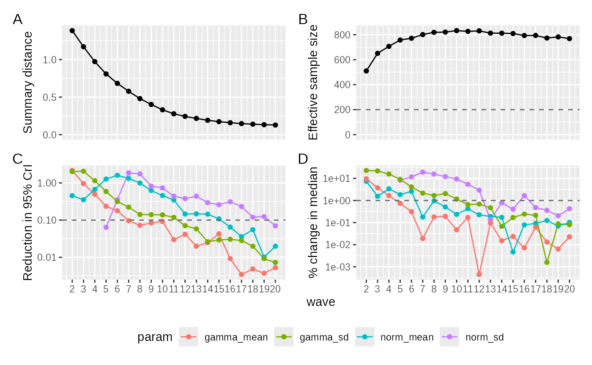
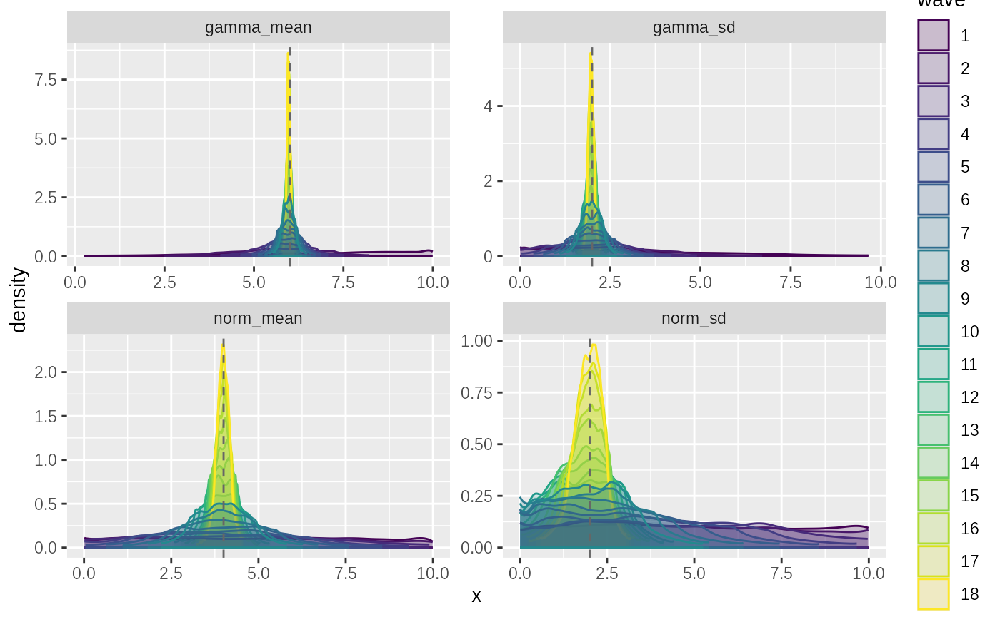
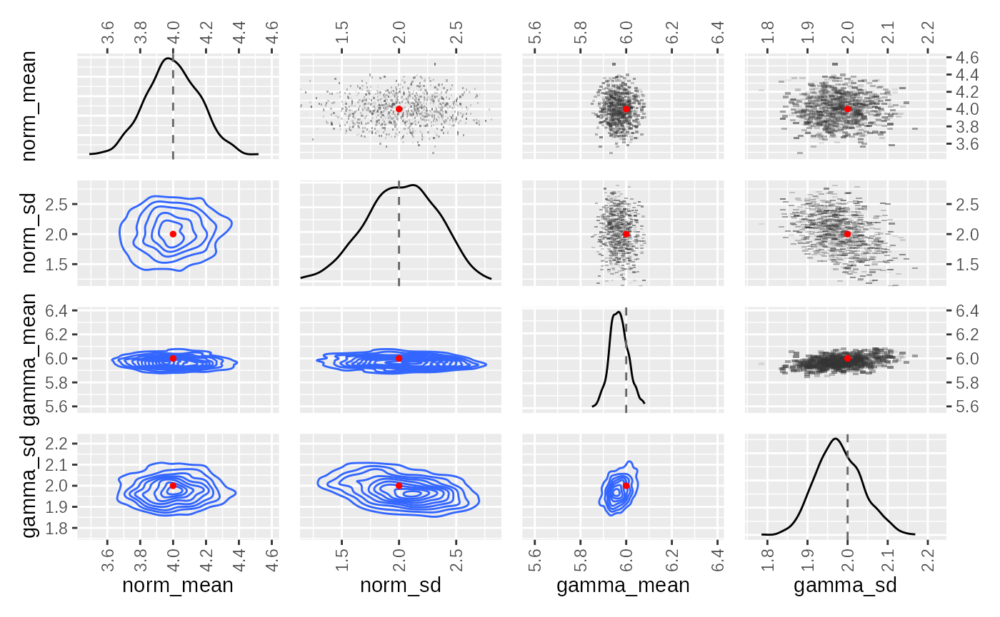

# ABC Sequential Monte-Carlo

``` r
library(tidyabc)
#> 
#> Attaching package: 'tidyabc'
#> The following objects are masked from 'package:base':
#> 
#>     transform, truncate
library(dplyr)
#> 
#> Attaching package: 'dplyr'
#> The following objects are masked from 'package:stats':
#> 
#>     filter, lag
#> The following objects are masked from 'package:base':
#> 
#>     intersect, setdiff, setequal, union
library(ggplot2)
```

``` r

# example simulation
# Well be trying to recover norm and gamma parameters
# We'll use this function for both example generation and fitting
test_simulation_fn = function(norm_mean, norm_sd, gamma_mean, gamma_sd) {
  
  A = rnorm(1000, norm_mean, norm_sd)
  B = rgamma2(1000, gamma_mean, gamma_sd)
  C = rgamma2(1000, gamma_mean, gamma_sd)

  return(
    list(
      data1 = A + B - C,
      data2 = B * C
    )
  )
  
}
```

``` r

test_scorer_fn = function(simdata, obsdata) {
  return(list(
    data1 = calculate_wasserstein(obsdata$data1, simdata$data1),
    data2 = calculate_wasserstein(obsdata$data2, simdata$data2)
  ))
}

test_scorewt = c(data1 = 1,data2 = 2)
```

``` r

tmp = test_simulation(
  test_simulation_fn,
  test_scorer_fn,
  norm_mean = 4, norm_sd=2, gamma_mean=6, gamma_sd=2,
  seed = 123
)

truth = tmp$truth
test_obsdata = tmp$obsdata
```

``` r

ggplot(
  tibble(data1 = test_obsdata$data1), aes(x=data1))+
  geom_histogram(,binwidth = 1)+
  xlab("A + B - C")
```


``` r

ggplot(tibble(data2 = test_obsdata$data2), aes(x=data2))+
  geom_histogram(,binwidth = 1)+
  xlab("B x C")
```


``` r
test_priors = priors(
  norm_mean ~ unif(0, 10),
  norm_sd ~ unif(0, 10),
  gamma_mean ~ unif(0, 10),
  gamma_sd ~ unif(0, 10),
  # enforces convex gamma:
  ~ gamma_mean > gamma_sd 
)

test_priors
#> Parameters: 
#> * norm_mean: unif(min = 0, max = 10)
#> * norm_sd: unif(min = 0, max = 10)
#> * gamma_mean: unif(min = 0, max = 10)
#> * gamma_sd: unif(min = 0, max = 10)
#> Constraints:
#> * gamma_mean > gamma_sd
```

``` r

smc_fit = abc_smc(
  obsdata = test_obsdata,
  priors_list = test_priors,
  sim_fn = test_simulation_fn,
  scorer_fn = test_scorer_fn,
  n_sims = 1000,
  acceptance_rate = 0.5,
  distance_method = "euclidean",
  parallel= FALSE,
  scoreweights = test_scorewt
)
#> ABC-SMC
#> SMC waves:  ■                                  0% | wave 1 ETA:  6m
#> SMC waves:  ■                                  1% | wave 2 ETA:  5m
#> SMC waves:  ■                                  2% | wave 5 ETA:  5m
#> SMC waves:  ■■                                 3% | wave 9 ETA:  5m
#> SMC waves:  ■■                                 4% | wave 13 ETA:  5m
#> SMC waves:  ■■                                 5% | wave 16 ETA:  5m
#> Converged on wave: 20
#> SMC waves:  ■■■                                5% | wave 19 ETA:  5m

summary(smc_fit)
#> ABC SMC fit: 20 waves - (converged)
#> Parameter estimates:
#> # A tibble: 4 × 4
#> # Groups:   param [4]
#>   param      mean_sd       median_95_CrI           ESS
#>   <chr>      <chr>         <chr>                 <dbl>
#> 1 gamma_mean 5.970 ± 0.044 5.969 [5.857 — 6.085]  769.
#> 2 gamma_sd   1.981 ± 0.061 1.979 [1.832 — 2.150]  769.
#> 3 norm_mean  3.997 ± 0.169 3.996 [3.558 — 4.450]  769.
#> 4 norm_sd    2.020 ± 0.323 2.031 [1.218 — 2.753]  769.
```

``` r
plot(smc_fit, truth=truth)
```


``` r
plot_convergence(smc_fit)
```



``` r
plot_evolution(smc_fit,truth)
```



``` r
plot_correlations(smc_fit$posteriors, truth)
```


