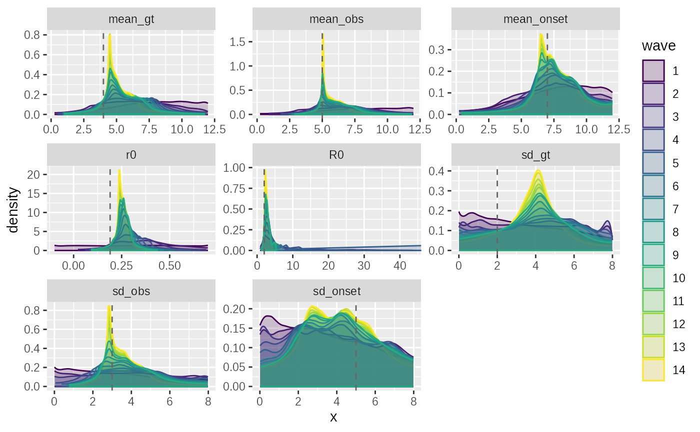
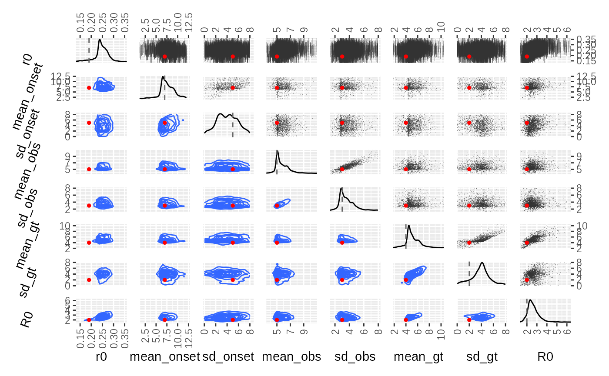
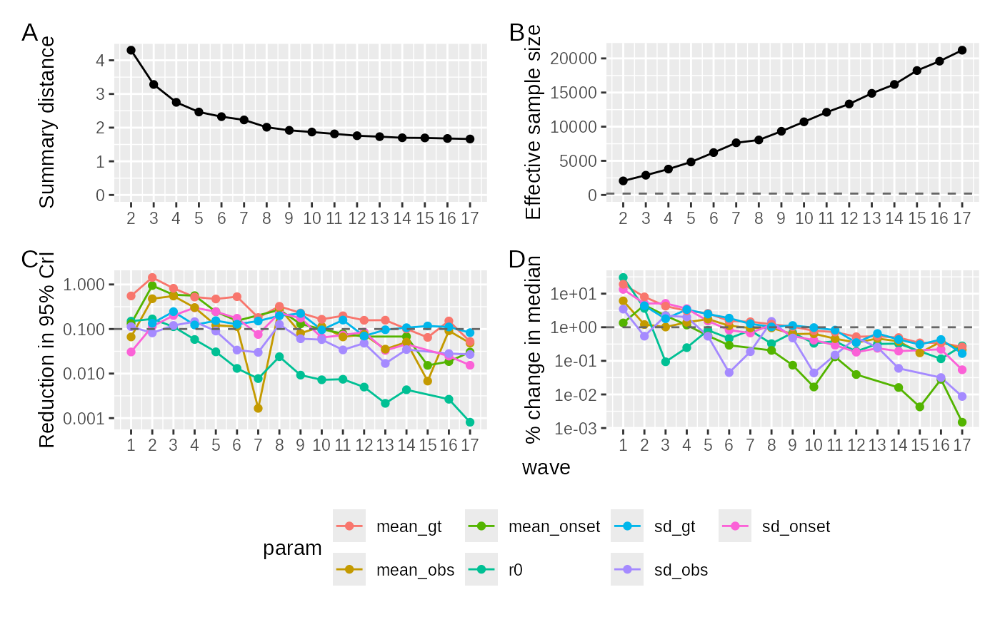
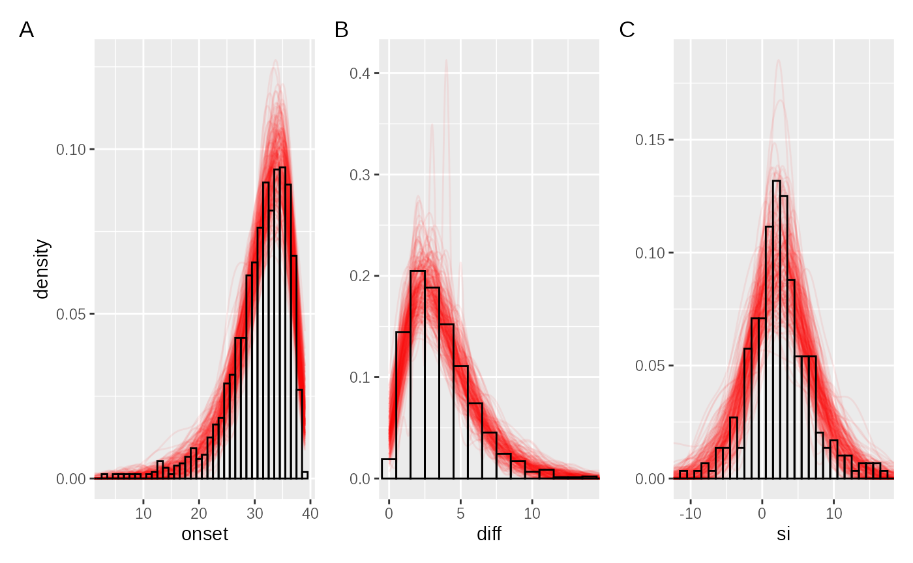
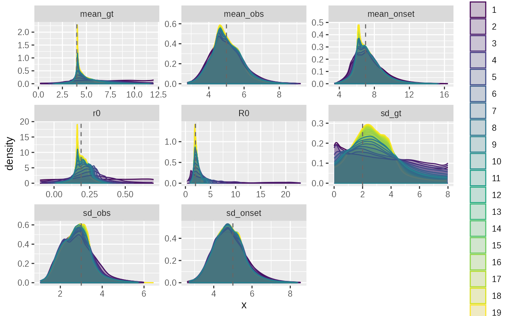
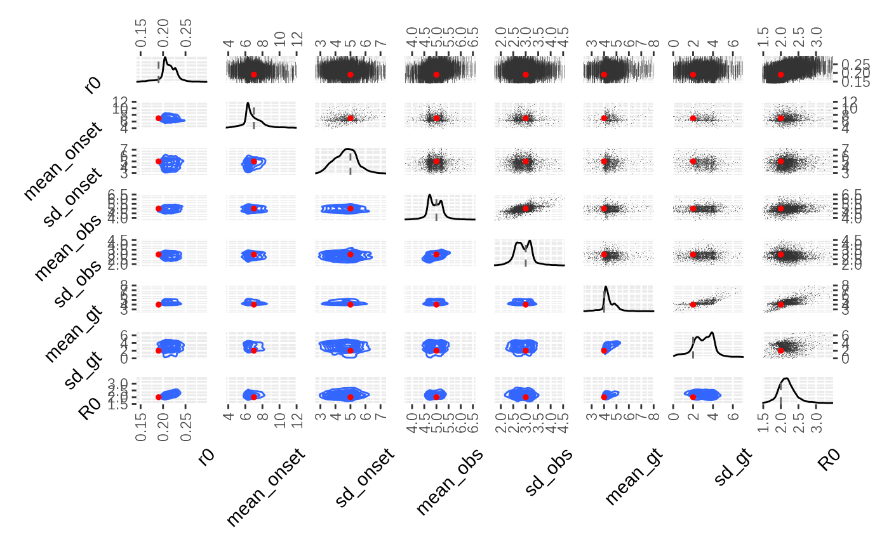
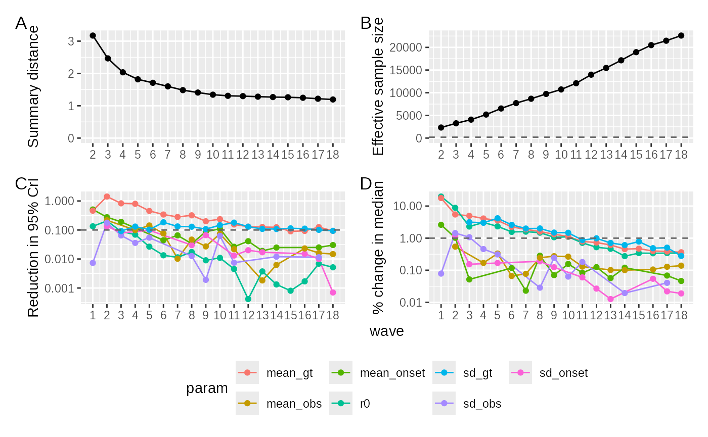
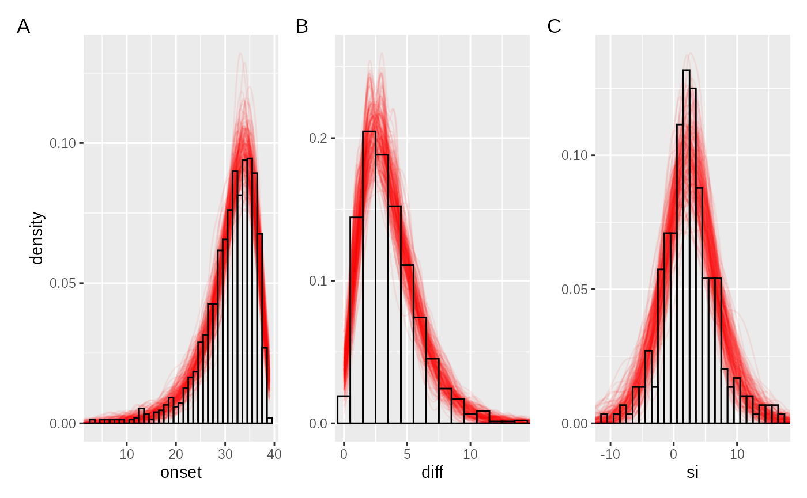

# Early outbreak and Generation time

## Simulation

### Setup simulation

``` r
sim_params = list(
  # A short generation time
  mean_gt = 4,
  sd_gt = 2,
  R0 = 2,
  I0 = 10,
  # Add a longish and very variable delay to symptoms
  p_symptomatic = 0.3,
  mean_onset = 7,
  sd_onset = 5,
  # and a slightly shorter delay to observation:
  # Only symptomatic cases are observed
  p_detected_given_symptoms = 0.7,
  mean_obs = 5,
  sd_obs = 3,
  # Observation cutoff:
  T_obs = 40
)

# Run simulation ----

sim_ip = ggoutbreak::make_gamma_ip(
  median_of_mean = sim_params$mean_gt,
  median_of_sd = sim_params$sd_gt
)

sim_params$r0 = ggoutbreak::inv_wallinga_lipsitch(sim_params$R0, sim_ip)

truth = ggoutbreak::sim_branching_process(
  fn_Rt = ~ sim_params$R0,
  fn_ip = ~sim_ip,
  fn_imports = \(t) ifelse(t == 1, sim_params$I0, 0),
  max_time = 40
)
```

    ## ....................complete
    ## interfacer: development mode active (local function).

``` r
delayed = truth %>%
  ggoutbreak::sim_delay(
    p_fn = ~ sim_params$p_symptomatic,
    delay_fn = ~ ggoutbreak::rgamma2(
      .x,
      sim_params$mean_onset,
      sim_params$sd_onset
    ),
    input = "time",
    output = "symptom"
  ) %>%
  ggoutbreak::sim_delay(
    p_fn = \(t, symptom) {
      ifelse(symptom, sim_params$p_detected_given_symptoms, 0)
    },
    delay_fn = ~ ggoutbreak::rgamma2(
      .x,
      sim_params$mean_obs,
      sim_params$sd_obs
    ),
    input = "symptom_time",
    output = "observation"
  )


observed = delayed %>% dplyr::filter(observation_time < sim_params$T)

traced_contacts = observed %>%
  dplyr::semi_join(observed, by = c("infector" = "id"))
```

### Index case onset

``` r
index_case_onset = observed %>% dplyr::transmute(onset_time = floor(symptom_time))

ggplot(index_case_onset, aes(x=onset_time))+geom_histogram(binwidth = 1)
```


### Delay to observation

``` r
# Data

delay_distribution = observed %>% dplyr::transmute(
  obs_delay = floor(observation_time) - floor(symptom_time)
)

ggplot(delay_distribution, aes(x = obs_delay))+geom_histogram(binwidth = 1)+
  xlab("symptom to observation")
```


### Observed serial interval

``` r
serial_pairs = observed %>%
  inner_join(
    traced_contacts,
    by = c("id" = "infector"),
    suffix = c(".1", ".2")
  ) %>%
  transmute(
    serial_interval = floor(symptom_time.2) - floor(symptom_time.1) #order known
    # serial_interval = abs(floor(symptom_time.2) - floor(symptom_time.1)) #order uncertain
  ) 


ggplot(serial_pairs) +
  geom_histogram(aes(x = serial_interval), binwidth = 1)+
  xlab("symptom serial interval (given observed)")
```


``` r
obsdata = list(
  onset = as.numeric(index_case_onset$onset_time),
  diff = as.numeric(delay_distribution$obs_delay),
  si = as.numeric(serial_pairs$serial_interval)
)
```

## Model

Aim is to fit a model to all 3 aspects of the data simultaneously. The
model makes the following hard assumptions:

- constant exponential growth in infection times (hidden t_inf)
- delayed onset to symptoms - gamma distributed (t_onset = t_inf +
  onset_delay)
- delayed observation of symptoms - gamma distributed (t_obs = onset +
  obs_delay)
- secondary case delayed by generation time (hidden t_inf2 = t_inf +
  gt_delay)
- secondary case symptom onset and observation as above (t_onset_2 /
  t_obs_2)
- cases only observed if t_obs / t_obs_2 within time window (0-T)

\\ \begin{align} t\_{max} - T\_{inf} &\sim Exp(r_0) \\ \Delta T\_{inf
\rightarrow onset} &\sim Gamma(\mu\_{onset},\sigma\_{onset}) \\ \Delta
T\_{onset \rightarrow obs} &\sim Gamma(\mu\_{obs},\sigma\_{obs}) \\
\Delta T\_{gt} &\sim Gamma(\mu\_{gt},\sigma\_{gt}) \\ \end{align} \\

\\ \begin{align} T\_{onset} &= T\_{inf} + \Delta T\_{inf \rightarrow
onset} \\ T\_{obs} &= T\_{onset} + \Delta T\_{onset \rightarrow obs}\\
T\_{inf_2} &= T\_{inf_1} + \Delta T\_{gt} \\ \Delta T\_{onset_1
\rightarrow onset_2} &= \Delta T\_{gt} + \Delta T\_{inf_2 \rightarrow
onset_2} - \Delta T\_{inf_1 \rightarrow onset_1} \\ \end{align} \\

\\ \begin{align} O_1 &= I(t_0 \le T\_{onset_1}, T\_{obs_1} \le t\_{max})
\\ O\_{1,2} &= I(O_1, t_0 \le T\_{onset_2}, T\_{obs_2} \le t\_{max})\\
T\_{onset_1}\|O_1 &\Rightarrow \text{primary case times}\\ \Delta
T\_{onset_1 \rightarrow obs_1}\|O_1 &\Rightarrow \text{onset to
interview delay}\\ \Delta T\_{onset_1 \rightarrow onset_2}\|O\_{1,2}
&\Rightarrow \text{onset to onset serial interval}\\ \end{align} \\

``` r
n = nrow(observed)

sim1_fn = carrier::crate(
  function(r0, mean_onset, sd_onset, mean_obs, sd_obs, mean_gt, sd_gt, R0, ...) {
    
    # Primary case infection time
    # exponentially distributed in time. Need to make sure we have enough samples 
    # before t0 observation cutoff to account for early observed cases.
    
    t_early = - stats::qgamma(0.99,mean_onset,sd_onset) # t starts at 0
    t_inf_1 = tidyabc::rexpgrowth(n, r0, T_obs, t_early)
    
    onset_delay = tidyabc::rgamma2(n, mean_onset, sd_onset)
    obs_delay = tidyabc::rgamma2(n, mean_obs, sd_obs)
    
    t_onset_1 = t_inf_1 + onset_delay
    t_obs_1 = t_onset_1 + obs_delay
    
    # Primary case observations:
    # Onset after t0 and observed before T
    obs_1 = t_obs_1 < T_obs & t_onset_1 > 0
    
    t_inf_1 = t_inf_1[obs_1]
    t_onset_1 = t_onset_1[obs_1]
    t_obs_1 = t_obs_1[obs_1]
    
    n1 = length(t_inf_1)
    
    # Secondary case. Numbers of secondary cases are poission(R0). Could add 
    # dispersion here and fit it also
    # Only observed primary will be observed secondary so we can restrict to 
    # observed subset
    # browser()
    case_2ary = stats::rpois(n1,R0)
    index_1ary = rep(seq_along(case_2ary), case_2ary)
    n2 = length(index_1ary)
    
    gt_delay = tidyabc::rgamma2(n2, mean_gt, sd_gt)
    onset_delay_2 = tidyabc::rgamma2(n2, mean_onset, sd_onset)
    obs_delay_2 = tidyabc::rgamma2(n2, mean_obs, sd_obs)
    
    t_inf_2 = t_inf_1[index_1ary] + gt_delay
    t_onset_2 = t_inf_2 + onset_delay_2
    t_obs_2 = t_onset_2 + obs_delay_2
    
    # order dependent
    serial_interval = floor(t_onset_2) - floor(t_onset_1[index_1ary])
    # order independent
    # serial_interval = abs(floor(t_onset_2) - floor(t_onset_1[index_1ary]))
    
    # Secondary case observations
    obs_2 = t_obs_2 < T_obs & t_onset_2 > 0
    
    serial_interval = serial_interval[obs_2]
    t_onset_2 = t_onset_2[obs_2]
    
    return(list(
      onset = floor(t_onset_1),
      diff = floor(t_obs_1) - floor(t_onset_1),
      si = serial_interval
    ))
  },
  T_obs = sim_params$T_obs,
  n=n
)
```

``` r
scorer1_fn = function(simdata, obsdata) {
  
  onset = calculate_wasserstein(simdata$onset, obsdata$onset)
  diff = calculate_wasserstein(simdata$diff, obsdata$diff)
  si = calculate_wasserstein(simdata$si, obsdata$si)
  mad_si = abs(mean(simdata$si) - mean(obsdata$si))
  
  return(list(
    sim_onset = onset,
    sim_diff = diff,
    sim_si=si,
    sim_mad_si = mad_si
  ))
}
```

``` r
test = tidyabc::test_simulation(
  sim_fn = sim1_fn, 
  scorer_fn = scorer1_fn,
  params = sim_params,
  obsdata = obsdata
  # debug=TRUE
)

# .gg_hist(test$obsdata$onset)
```

### Scoring

We are going to fit the model in a custom ABC with rejection framework

I’m assessing model fits to the data using an earth movers distance at
the level of individual’s observed times versus simulations observed
times. Given that simulations cutoff different numbers of people I have
to match the size of the simulation and observed data

### Priors

Use a set of uninformative priors. RO is derived from Wallinga-Lipsitch,
Gamma distributions hyperparameters constrained so that they are convex:

``` r
priors = priors(
  r0 ~ unif(-0.1, 0.7),
  mean_onset ~ unif(0, 12),
  sd_onset ~ unif(0, 8),
  mean_obs ~ unif(0, 12),
  sd_obs ~ unif(0, 8),
  mean_gt ~ unif(0, 12),
  sd_gt ~ unif(0, 8),
  R0 ~ (1+r0*sd_gt^2/mean_gt) ^ (mean_gt^2 / sd_gt^2),
  ~ is.finite(R0) & R0 > 0,
  ~ mean_onset > sd_onset,
  ~ mean_obs > sd_obs,
  ~ mean_gt > sd_gt
)

priors
```

    ## Parameters: 
    ## * r0: unif(min = -0.1, max = 0.7)
    ## * mean_onset: unif(min = 0, max = 12)
    ## * sd_onset: unif(min = 0, max = 8)
    ## * mean_obs: unif(min = 0, max = 12)
    ## * sd_obs: unif(min = 0, max = 8)
    ## * mean_gt: unif(min = 0, max = 12)
    ## * sd_gt: unif(min = 0, max = 8)
    ## Constraints:
    ## * is.finite(R0) & R0 > 0
    ## * mean_onset > sd_onset
    ## * mean_obs > sd_obs
    ## * mean_gt > sd_gt
    ## Derived values:
    ## * R0 = (1 + r0 * sd_gt^2/mean_gt)^(mean_gt^2/sd_gt^2)

``` r
abc_fit = abc_rejection(
  obsdata = obsdata,
  priors_list = priors,
  sim_fn = sim1_fn,
  scorer_fn = scorer1_fn,
  n_sims = 1000,
  acceptance_rate = 0.5,
  parallel = TRUE
)
```

    ## ABC rejection, 1 wave.

    ## Warning in stats::qnorm(q, -0.218539809534936, 0.0688397280660186): NaNs
    ## produced

    ## Warning in stats::qnorm(q, -0.244607370400033, 0.151144461187998): NaNs
    ## produced

``` r
# summary(abc_fit)
metrics = posterior_distance_metrics(abc_fit)

# make the serial interval fitting much more important:
scoreweights1 = metrics$scoreweights 
# *
#   c(
#     sim_onset = 2,
#     sim_diff = 1,
#     sim_si = 3,
#     sim_mad_si = 3
#   )

# scoreweights1 = 
#   c(
#     sim_onset = 2,
#     sim_diff = 1,
#     sim_si = 3,
#     sim_mad_si = 4
#   )
```

``` r
smc_fit = abc_smc(
  obsdata = obsdata,
  priors_list = priors,
  sim_fn = sim1_fn,
  scorer_fn = scorer1_fn,
  n_sims = 8000,
  acceptance_rate = 0.5,
  #debug_errors = TRUE,
  parallel = TRUE,
  scoreweights = scoreweights1
)
```

    ## ABC-SMC

    ## Warning in stats::qnorm(q, -0.206492510850451, 0.0698523318900587): NaNs
    ## produced

    ## Warning in stats::qnorm(q, -0.220619577453376, 0.140110644777754): NaNs
    ## produced

    ## SMC waves:  ■                                  1% | wave 1 ETA:  5m

    ## SMC waves:  ■■                                 2% | wave 2 ETA:  5m

    ## SMC waves:  ■■                                 4% | wave 3 ETA:  5m

    ## SMC waves:  ■■■                                6% | wave 4 ETA:  5m

    ## SMC waves:  ■■■                                8% | wave 5 ETA:  5m

    ## SMC waves:  ■■■■                              10% | wave 6 ETA:  5m

    ## SMC waves:  ■■■■■                             13% | wave 7 ETA:  4m

    ## SMC waves:  ■■■■■                             15% | wave 8 ETA:  4m

    ## SMC waves:  ■■■■■■                            17% | wave 9 ETA:  4m

    ## SMC waves:  ■■■■■■■                           20% | wave 10 ETA:  4m

    ## SMC waves:  ■■■■■■■■                          22% | wave 11 ETA:  4m

    ## SMC waves:  ■■■■■■■■                          25% | wave 12 ETA:  4m

    ## SMC waves:  ■■■■■■■■■                         27% | wave 13 ETA:  4m

    ## SMC waves:  ■■■■■■■■■■                        29% | wave 14 ETA:  4m

    ## SMC waves:  ■■■■■■■■■■■                       32% | wave 15 ETA:  3m

    ## SMC waves:  ■■■■■■■■■■■                       34% | wave 16 ETA:  3m

    ## SMC waves:  ■■■■■■■■■■■■                      37% | wave 17 ETA:  3m

    ## SMC waves:  ■■■■■■■■■■■■■                     39% | wave 18 ETA:  3m

    ## SMC waves:  ■■■■■■■■■■■■■■                    42% | wave 19 ETA:  3m

    ## SMC waves:  ■■■■■■■■■■■■■■                    44% | wave 20 ETA:  3m

    ## SMC waves:  ■■■■■■■■■■■■■■■                   47% | wave 21 ETA:  3m

    ## SMC waves:  ■■■■■■■■■■■■■■■■                  49% | wave 22 ETA:  3m

    ## SMC waves:  ■■■■■■■■■■■■■■■■■                 52% | wave 23 ETA:  2m

    ## SMC waves:  ■■■■■■■■■■■■■■■■■                 54% | wave 24 ETA:  2m

    ## SMC waves:  ■■■■■■■■■■■■■■■■■■                57% | wave 25 ETA:  2m

    ## SMC waves:  ■■■■■■■■■■■■■■■■■■■               60% | wave 26 ETA:  2m

    ## SMC waves:  ■■■■■■■■■■■■■■■■■■■■              62% | wave 27 ETA:  2m

    ## SMC waves:  ■■■■■■■■■■■■■■■■■■■■              65% | wave 28 ETA:  2m

    ## Converged on wave: 29

``` r
summary(smc_fit)
```

    ## ABC SMC fit: 29 waves - (converged)
    ## Parameter estimates:
    ## # A tibble: 8 × 4
    ## # Groups:   param [8]
    ##   param      mean_sd       median_95_CrI            ESS
    ##   <chr>      <chr>         <chr>                  <dbl>
    ## 1 R0         2.029 ± 0.243 1.990 [1.616 — 2.556]  6340.
    ## 2 mean_gt    4.403 ± 1.001 4.268 [2.547 — 7.584]  6340.
    ## 3 mean_obs   5.238 ± 0.645 5.152 [4.029 — 7.595]  6340.
    ## 4 mean_onset 5.738 ± 1.617 5.625 [2.334 — 10.199] 6340.
    ## 5 r0         0.201 ± 0.018 0.201 [0.161 — 0.255]  6340.
    ## 6 sd_gt      3.386 ± 1.476 3.374 [0.490 — 6.908]  6340.
    ## 7 sd_obs     3.351 ± 0.664 3.264 [2.117 — 5.695]  6340.
    ## 8 sd_onset   3.640 ± 1.173 3.502 [1.408 — 6.855]  6340.

``` r
plot(smc_fit,truth = sim_params)
```


``` r
plot_evolution(smc_fit,truth = sim_params)
```


``` r
adaptive_fit = abc_adaptive(
  obsdata = obsdata,
  priors_list = priors,
  sim_fn = sim1_fn,
  scorer_fn = scorer1_fn,
  n_sims = 4000,
  acceptance_rate = 0.2,
  # debug_errors = TRUE,
  parallel = TRUE,
  scoreweights = scoreweights1
)
```

    ## ABC-Adaptive

    ## Warning in stats::qnorm(q, -0.203372935374894, 0.0701163450564314): NaNs
    ## produced

    ## Adaptive waves:  ■                                  0% | wave 1 ETA:  6m

    ## Adaptive waves:  ■                                  1% | wave 3 ETA:  5m

    ## Adaptive waves:  ■■                                 3% | wave 6 ETA:  5m

    ## Adaptive waves:  ■■                                 4% | wave 8 ETA:  5m

    ## Adaptive waves:  ■■                                 5% | wave 10 ETA:  5m

    ## Adaptive waves:  ■■■                                6% | wave 12 ETA:  5m

    ## Converged on wave: 13

``` r
summary(adaptive_fit)
```

    ## ABC adaptive fit: 13 waves - (converged)
    ## Parameter estimates:
    ## # A tibble: 8 × 4
    ## # Groups:   param [8]
    ##   param      mean_sd       median_95_CrI            ESS
    ##   <chr>      <chr>         <chr>                  <dbl>
    ## 1 R0         2.669 ± 0.713 2.541 [1.735 — 4.057]  4731.
    ## 2 mean_gt    5.169 ± 1.215 4.922 [2.091 — 9.709]  4731.
    ## 3 mean_obs   5.781 ± 1.015 5.507 [3.725 — 9.855]  4731.
    ## 4 mean_onset 7.531 ± 1.769 7.395 [2.159 — 11.314] 4731.
    ## 5 r0         0.246 ± 0.032 0.247 [0.138 — 0.349]  4731.
    ## 6 sd_gt      3.835 ± 1.460 3.961 [0.559 — 7.052]  4731.
    ## 7 sd_obs     3.619 ± 1.027 3.396 [1.595 — 6.703]  4731.
    ## 8 sd_onset   4.031 ± 1.810 4.010 [0.517 — 7.536]  4731.

``` r
plot(adaptive_fit,truth = sim_params)
```


``` r
plot_evolution(adaptive_fit,truth = sim_params)
```



``` r
plot_correlations(adaptive_fit,truth = sim_params) & ggplot2::theme(
   axis.title.y = ggplot2::element_text(angle=70,vjust=0.1)
)
```



``` r
plot_convergence(adaptive_fit)
```



``` r
plot_simulations(obsdata, adaptive_fit, sim_fn = sim1_fn)
```



``` r
priors2 = priors(
  r0 ~ unif(-0.1, 0.7),
  mean_onset ~ lnorm2(7, 2),
  sd_onset ~ lnorm2(5, 1),
  mean_obs ~ lnorm2(5, 1),
  sd_obs ~ lnorm2(3, 1),
  mean_gt ~ unif(0, 12),
  sd_gt ~ unif(0, 8),
  R0 ~ (1+r0*sd_gt^2/mean_gt) ^ (mean_gt^2 / sd_gt^2),
  ~ is.finite(R0) & R0 > 0,
  ~ mean_onset > sd_onset,
  ~ mean_obs > sd_obs,
  ~ mean_gt > sd_gt
)

priors2
```

    ## Parameters: 
    ## * r0: unif(min = -0.1, max = 0.7)
    ## * mean_onset: lnorm2(mean = 7, sd = 2)
    ## * sd_onset: lnorm2(mean = 5, sd = 1)
    ## * mean_obs: lnorm2(mean = 5, sd = 1)
    ## * sd_obs: lnorm2(mean = 3, sd = 1)
    ## * mean_gt: unif(min = 0, max = 12)
    ## * sd_gt: unif(min = 0, max = 8)
    ## Constraints:
    ## * is.finite(R0) & R0 > 0
    ## * mean_onset > sd_onset
    ## * mean_obs > sd_obs
    ## * mean_gt > sd_gt
    ## Derived values:
    ## * R0 = (1 + r0 * sd_gt^2/mean_gt)^(mean_gt^2/sd_gt^2)

``` r
adaptive_fit2 = abc_adaptive(
  obsdata = obsdata,
  priors_list = priors2,
  sim_fn = sim1_fn,
  scorer_fn = scorer1_fn,
  n_sims = 4000,
  acceptance_rate = 0.2,
  # debug_errors = TRUE,
  parallel = TRUE,
  scoreweights = scoreweights1
)
```

    ## ABC-Adaptive

    ## Warning in stats::qnorm(q, -0.219098965642995, 0.0641085802091193): NaNs
    ## produced

    ## Adaptive waves:  ■                                  0% | wave 1 ETA:  6m

    ## Adaptive waves:  ■                                  1% | wave 3 ETA:  5m

    ## Adaptive waves:  ■■                                 2% | wave 5 ETA:  5m

    ## Adaptive waves:  ■■                                 3% | wave 7 ETA:  5m

    ## Adaptive waves:  ■■                                 4% | wave 9 ETA:  5m

    ## Adaptive waves:  ■■■                                6% | wave 11 ETA:  5m

    ## Adaptive waves:  ■■■                                6% | wave 12 ETA:  5m

    ## Converged on wave: 14

    ## Adaptive waves:  ■■■                                7% | wave 13 ETA:  5m

``` r
summary(adaptive_fit2)
```

    ## ABC adaptive fit: 14 waves - (converged)
    ## Parameter estimates:
    ## # A tibble: 8 × 4
    ## # Groups:   param [8]
    ##   param      mean_sd       median_95_CrI           ESS
    ##   <chr>      <chr>         <chr>                 <dbl>
    ## 1 R0         2.191 ± 0.292 2.159 [1.747 — 2.791] 6183.
    ## 2 mean_gt    4.448 ± 0.735 4.298 [2.464 — 7.941] 6183.
    ## 3 mean_obs   4.950 ± 0.344 4.928 [4.053 — 6.062] 6183.
    ## 4 mean_onset 6.899 ± 1.180 6.649 [4.654 — 9.984] 6183.
    ## 5 r0         0.213 ± 0.020 0.213 [0.145 — 0.286] 6183.
    ## 6 sd_gt      3.058 ± 1.115 3.113 [0.583 — 6.404] 6183.
    ## 7 sd_obs     2.908 ± 0.384 2.880 [2.009 — 4.113] 6183.
    ## 8 sd_onset   4.702 ± 0.778 4.720 [3.258 — 6.500] 6183.

``` r
plot(adaptive_fit2,truth = sim_params)
```


``` r
plot_evolution(adaptive_fit2,truth = sim_params)
```



``` r
plot_correlations(adaptive_fit2,truth = sim_params) & ggplot2::theme(
   axis.title.y = ggplot2::element_text(angle=45,vjust=0, hjust=1),
   axis.title.x = ggplot2::element_text(angle=45, hjust=1) #,vjust=1, hjust=0.5)
)
```



``` r
plot_convergence(adaptive_fit2)
```



``` r
plot_simulations(obsdata, adaptive_fit2, sim_fn = sim1_fn)
```


